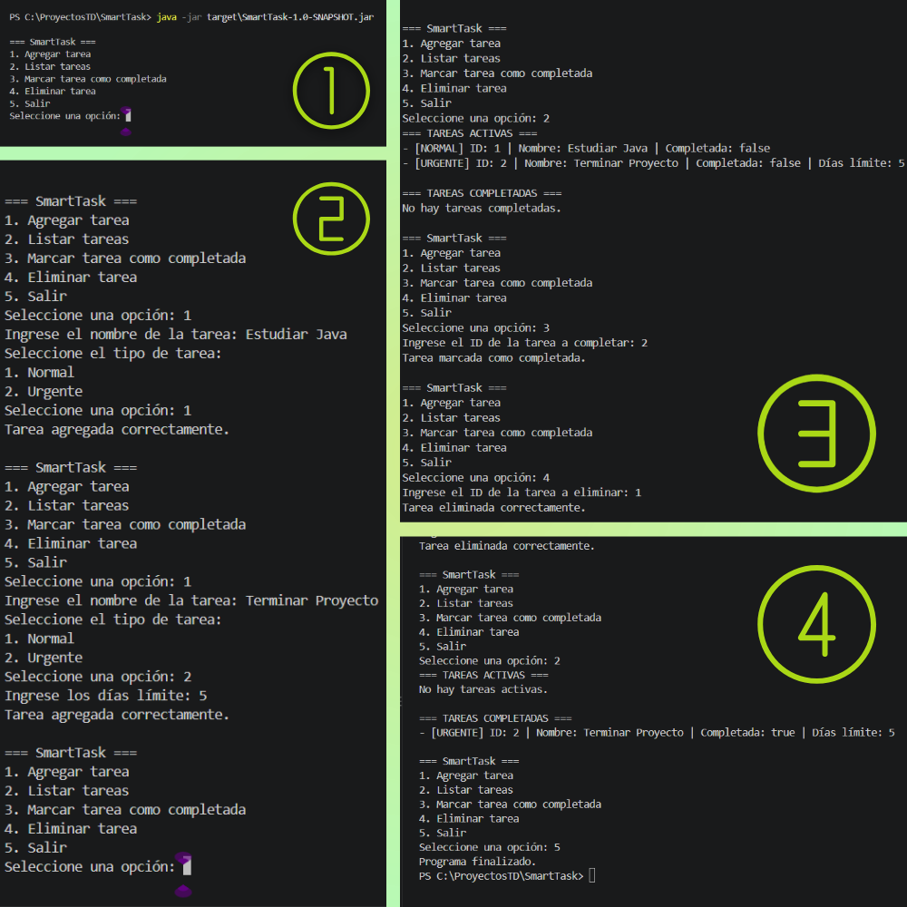

# ☕ SmartTask

### Personal Task Management — Java Console Application

> Aplicación de consola desarrollada en Java para gestionar tareas normales y urgentes, aplicando fundamentos de Programación Orientada a Objetos, interfaces, herencia, polimorfismo, colecciones y pruebas automatizadas.

---

## 📋 Tabla de Contenidos

* [Descripción](#-descripción)
* [Funcionalidades](#-funcionalidades)
* [Objetivos de aprendizaje](#-objetivos-de-aprendizaje)
* [Conceptos POO implementados](#-conceptos-poo-implementados)
* [Conceptos Java utilizados](#-conceptos-java-utilizados)
* [Estructura del proyecto](#-estructura-del-proyecto)
* [Cómo funciona](#-cómo-funciona)
* [Cómo compilar](#-cómo-compilar)
* [Cómo ejecutar](#-cómo-ejecutar)
* [Pruebas y cobertura](#-pruebas-y-cobertura)
* [Documentación JavaDoc](#-documentación-javadoc)
* [Empaquetado y ejecutable JAR](#-empaquetado-y-ejecutable-jar)
* [Ejemplo de ejecución](#-ejemplo-de-ejecución)
* [Captura de funcionamiento](#-captura-de-funcionamiento)
* [Estructura de clases](#-estructura-de-clases)
* [Próximas Implementaciones](#-próximas-implementaciones)
* [Enlace al repositorio](#-enlace-al-repositorio)

---

## 📌 Descripción

**SmartTask** es una aplicación de consola desarrollada en Java como proyecto práctico del curso.

Su objetivo es permitir al usuario administrar una lista de tareas desde un menú interactivo, diferenciando entre:

* 📝 Tareas normales
* 🚨 Tareas urgentes
* ✅ Tareas completadas
* 📋 Tareas activas

Los identificadores de las tareas son asignados automáticamente por el sistema y no son ingresados directamente por el usuario.

El proyecto fue desarrollado progresivamente aplicando los contenidos estudiados durante las distintas lecciones del curso.

---

## ✨ Funcionalidades

| Funcionalidad                 | Descripción                                     |
| ----------------------------- | ----------------------------------------------- |
| 📝 **Agregar tarea normal**   | Crea una tarea sin fecha límite.                |
| 🚨 **Agregar tarea urgente**  | Crea una tarea indicando sus días límite.       |
| 📋 **Listar tareas**          | Separa las tareas activas de las completadas.   |
| ✅ **Completar tarea**         | Cambia el estado de una tarea utilizando su ID. |
| 🗑️ **Eliminar tarea**        | Elimina una tarea existente utilizando su ID.   |
| 🔢 **ID automático**          | El sistema asigna identificadores consecutivos. |
| 🛡️ **Validación de entrada** | Maneja entradas inválidas mediante `try-catch`. |

---

## 🎓 Objetivos de aprendizaje

Este proyecto busca demostrar la aplicación práctica de los siguientes conceptos:

* Comprender la estructura de una aplicación Java de consola.
* Aplicar Programación Orientada a Objetos.
* Utilizar encapsulamiento, herencia y polimorfismo.
* Trabajar con interfaces.
* Utilizar colecciones mediante `List` y `ArrayList`.
* Separar responsabilidades entre las distintas clases.
* Implementar pruebas automatizadas con JUnit 5.
* Medir la cobertura de pruebas mediante JaCoCo.
* Generar documentación técnica mediante JavaDoc.
* Empaquetar la aplicación como un archivo `.jar` ejecutable.
* Utilizar Maven para compilar, probar y empaquetar el proyecto.

---

## 🧠 Conceptos POO implementados

| Concepto                            | Implementación en SmartTask                                                                           |
| ----------------------------------- | ----------------------------------------------------------------------------------------------------- |
| **Encapsulamiento**                 | Los atributos de `Tarea` son privados y se accede a ellos mediante getters y setters.                 |
| **Herencia**                        | `TareaNormal` y `TareaUrgente` extienden `Tarea`.                                                     |
| **Polimorfismo**                    | `GestorTareas` trabaja con objetos del tipo `Tarea`, permitiendo almacenar distintos tipos de tareas. |
| **Abstracción mediante interfaz**   | `Accionable` define las operaciones principales del gestor.                                           |
| **Sobrescritura**                   | `TareaNormal` y `TareaUrgente` sobrescriben `toString()`.                                             |
| **Separación de responsabilidades** | `Main`, `GestorTareas` y las clases del modelo poseen responsabilidades diferenciadas.                |

---

## ☕ Conceptos Java utilizados

| Concepto           | Uso                                                         |
| ------------------ | ----------------------------------------------------------- |
| `class`            | Definición de las entidades y componentes de la aplicación. |
| Constructores      | Inicialización de objetos.                                  |
| Getters / Setters  | Acceso controlado a los atributos.                          |
| `List`             | Abstracción utilizada para almacenar las tareas.            |
| `ArrayList`        | Implementación de la colección de tareas.                   |
| `for` / `for-each` | Recorrido y búsqueda dentro de la colección.                |
| `switch`           | Gestión de las opciones del menú.                           |
| `try-catch`        | Manejo de entradas inválidas.                               |
| `Scanner`          | Lectura de datos desde consola.                             |
| `toString()`       | Representación textual de las tareas.                       |
| JUnit 5            | Pruebas automatizadas.                                      |
| JaCoCo             | Medición de cobertura de código.                            |
| JavaDoc            | Generación de documentación técnica HTML.                   |
| Maven              | Compilación, pruebas y empaquetado del proyecto.            |

---

## 🏗️ Estructura del proyecto

```text
SmartTask/
│
├── 📄 pom.xml
├── 📄 README.md
├── 📄 log_ejecucion.txt
├── 📄 log_tests.txt
│
├── 📁 docs/
│   ├── 📁 javadoc/
│   │   ├── 📄 index.html
│   │   ├── 📄 allclasses-index.html
│   │   ├── 📄 allpackages-index.html
│   │   └── 📁 ...
│   │
│   └── 📁 screenshots/
│       └── 📄 smarttask-ejecucion.png
│
├── 📁 src/
│   │
│   ├── 📁 main/
│   │   └── 📁 java/
│   │       └── 📁 com/
│   │           └── 📁 smarttask/
│   │               │
│   │               ├── 📄 Main.java
│   │               │
│   │               ├── 📁 model/
│   │               │   ├── 📄 Tarea.java
│   │               │   ├── 📄 TareaNormal.java
│   │               │   └── 📄 TareaUrgente.java
│   │               │
│   │               └── 📁 service/
│   │                   ├── 📄 Accionable.java
│   │                   └── 📄 GestorTareas.java
│   │
│   └── 📁 test/
│       └── 📁 java/
│           └── 📁 com/
│               └── 📁 smarttask/
│                   └── 📁 service/
│                       └── 📄 GestorTareasTest.java
│
└── 📁 target/
    └── 📁 ...  # Archivos generados por Maven
```

> **Nota:** La carpeta `target/` contiene archivos generados automáticamente por Maven y no forma parte del código fuente principal del proyecto.

---

## 🔄 Cómo funciona

La aplicación presenta un menú interactivo desde la consola:

```text
=== SmartTask ===
1. Agregar tarea
2. Listar tareas
3. Marcar tarea como completada
4. Eliminar tarea
5. Salir
```

Al agregar una tarea, el usuario selecciona entre:

```text
1. Normal
2. Urgente
```

Las tareas reciben automáticamente un identificador único mediante `GestorTareas`.

Las tareas pueden ser posteriormente listadas, completadas o eliminadas utilizando su ID.

---

## ⚙️ Cómo compilar

### Requisitos

* Java JDK 25
* Maven
* Git

Comprobar las versiones instaladas:

```powershell
java -version
mvn -version
```

Ubicarse en la carpeta del proyecto:

```powershell
cd C:\ProyectosTD\SmartTask
```

Compilar el proyecto:

```powershell
mvn compile
```

---

## ▶️ Cómo ejecutar

### Ejecutar mediante las clases compiladas

```powershell
java -cp target/classes com.smarttask.Main
```

### Ejecutar el archivo JAR

Después de empaquetar el proyecto:

```powershell
java -jar target\SmartTask-1.0-SNAPSHOT.jar
```

El archivo `.jar` fue configurado mediante Maven para utilizar `com.smarttask.Main` como clase principal.

---

## 🧪 Pruebas y cobertura

El proyecto utiliza **JUnit 5** para realizar pruebas automatizadas.

Las pruebas se encuentran en:

```text
src/test/java/com/smarttask/service/GestorTareasTest.java
```

Se implementaron los tres métodos de prueba solicitados:

```text
testAgregarTarea()
testListarTareas()
testMarcarComoCompletada()
```

Ejecutar las pruebas mediante Maven:

```powershell
mvn test
```

Resultado obtenido:

```text
Tests run: 3
Failures: 0
Errors: 0
Skipped: 0
```

### Cobertura de código

La cobertura fue medida utilizando **JaCoCo**.

| Paquete                 | Cobertura |
| ----------------------- | --------: |
| `com.smarttask.model`   |   **82%** |
| `com.smarttask.service` |   **92%** |
| Total del proyecto      |       54% |

El porcentaje total incluye `Main`, cuya cobertura no es representativa mediante estas pruebas automatizadas de servicio y modelo.

El requisito de cobertura de los paquetes principales `model` y `service` se cumple con valores superiores al 80%.

El reporte HTML generado por JaCoCo puede encontrarse dentro de los archivos generados por Maven en:

```text
target/site/jacoco/
```

---

## 📚 Documentación JavaDoc

El proyecto incorpora documentación mediante **JavaDoc**, utilizando comentarios especiales `/** ... */` en las clases documentadas.

La documentación HTML fue generada mediante Maven:

```powershell
mvn javadoc:javadoc
```

La documentación generada se conserva además dentro del proyecto en:

```text
docs/javadoc/
```

La página principal es:

```text
docs/javadoc/index.html
```

Esta documentación permite consultar la estructura y descripción de las clases del proyecto directamente desde un navegador.

---

## 📦 Empaquetado y ejecutable JAR

El proyecto fue configurado para generar un archivo `.jar` ejecutable mediante Maven.

Para generar el paquete:

```powershell
mvn clean package
```

Durante este proceso se ejecutan las pruebas automatizadas y posteriormente se genera:

```text
target/SmartTask-1.0-SNAPSHOT.jar
```

El archivo fue comprobado directamente desde consola mediante:

```powershell
java -jar target\SmartTask-1.0-SNAPSHOT.jar
```

La aplicación fue ejecutada correctamente desde el `.jar`, permitiendo:

* Iniciar el menú.
* Agregar una tarea.
* Seleccionar el tipo de tarea.
* Listar la tarea creada.
* Finalizar el programa correctamente.

Resultado de finalización:

```text
Programa finalizado.
```

---

## 📝 Ejemplo de ejecución

Una ejecución completa de la aplicación se encuentra documentada en:

```text
log_ejecucion.txt
```

La ejecución incluye:

1. Agregar una tarea normal.
2. Agregar una tarea urgente.
3. Listar las tareas.
4. Marcar una tarea como completada.
5. Eliminar una tarea.
6. Volver a listar las tareas.
7. Finalizar el programa.

---

## 🖥️ Captura de funcionamiento

A continuación se muestra una captura de la aplicación funcionando desde consola:



La captura complementa el registro de ejecución incluido en `log_ejecucion.txt`.

---

## 🧩 Estructura de clases

```text
                    ┌─────────────────────┐
                    │       Main          │
                    │ Interacción consola │
                    └──────────┬──────────┘
                               │
                               ▼
                    ┌─────────────────────┐
                    │   GestorTareas      │
                    │ Gestión de tareas   │
                    └──────────┬──────────┘
                               │
                    ┌──────────┴──────────┐
                    ▼                     ▼
             ┌──────────────┐      ┌──────────────┐
             │ TareaNormal  │      │ TareaUrgente │
             └──────┬───────┘      └──────┬───────┘
                    │                     │
                    └──────────┬──────────┘
                               ▼
                       ┌──────────────┐
                       │    Tarea     │
                       └──────────────┘
```

### `Tarea`

Clase base que representa una tarea y contiene:

* `id`
* `nombre`
* `completado`

### `TareaNormal`

Extiende `Tarea` y representa una tarea sin límite de días.

### `TareaUrgente`

Extiende `Tarea` y agrega el atributo:

* `diasLimite`

También incorpora el método `estaVencida()`.

### `Accionable`

Interfaz que define las operaciones principales disponibles para la gestión de tareas:

* `agregarTarea()`
* `listarTareas()`
* `marcarComoCompletada()`
* `eliminarTarea()`

### `GestorTareas`

Implementa `Accionable` y administra la colección de tareas, incluyendo la asignación automática de IDs.

### `Main`

Punto de entrada de la aplicación y responsable de la interacción con el usuario mediante consola.

---

## 🔮 Próximas Implementaciones

El proyecto puede continuar evolucionando con las siguientes mejoras:

| Mejora                                | Descripción                                                                                |
| ------------------------------------- | ------------------------------------------------------------------------------------------ |
| 📅 **Sistema real de vencimientos**   | Reemplazar el contador de días por `LocalDate` y calcular automáticamente tareas vencidas. |
| ✏️ **Edición de tareas**              | Permitir modificar el nombre o información de una tarea existente.                         |
| 💾 **Persistencia de datos**          | Incorporar almacenamiento permanente de las tareas.                                        |
| 🗄️ **Integración con base de datos** | Conectar la aplicación con una base de datos relacional.                                   |
| 🧪 **Mayor cobertura de pruebas**     | Ampliar las pruebas automatizadas a otros componentes y casos de uso.                      |
| 🖥️ **Interfaz gráfica**              | Evolucionar la aplicación de consola hacia una interfaz gráfica.                           |

---

## 🔗 Enlace al repositorio

Repositorio del proyecto:

**GitHub:**
https://github.com/CameronVelasquez/SmartTask

---

## 📄 Entregables principales

El proyecto incluye los siguientes elementos:

* Código fuente completo.
* Aplicación Java de consola.
* Pruebas automatizadas con JUnit 5.
* Reporte de cobertura mediante JaCoCo.
* Documentación JavaDoc generada en HTML.
* Archivo `.jar` ejecutable.
* Registro de ejecución en `log_ejecucion.txt`.
* Registro de pruebas en `log_tests.txt`.
* Documentación del proyecto en `README.md`.
* Captura del funcionamiento de la aplicación.
